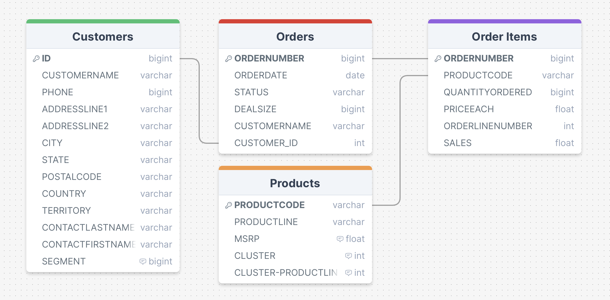

<details>
    <summary style="background-color:#6495ED; border-radius:10px; font-weight: bold; font-size:18px; color:#FFFFFF; box-shadow: 5px 7px 5px rgba(0, 0, 0, 0.5); padding: 5px 10px 5px 10px;">CLICK FOR ENGLISH DESCRIPTION</summary>
    
## About the Database
The original dataset was a single `./sales_data_sample.csv` file. However, to adapt it to a database structure, I split it in various ways and turned it into different tables.

My tables and the DBML query for them are located in `./PostgreSQL/schema_dbml.sql`, which is in the same path as this document.

## Tables

<details>
    <summary style="font-weight: bold; color:#6495ED; padding: 5px 10px 5px 10px; background-color: white; border-radius: 50px">CLICK FOR SHOW THE HEAD OF THE TABLES</summary>

### CUSTOMERS Table:

| CUSTOMERNAME          | PHONE        | ADDRESSLINE1           | ADDRESSLINE2 | CITY         | STATE | POSTALCODE | COUNTRY | TERRITORY | CONTACTLASTNAME | CONTACTFIRSTNAME | ID |
|-----------------------|--------------|------------------------|--------------|--------------|-------|------------|---------|------------|-----------------|------------------|----|
| Land of Toys Inc.     | 2125557818   | 897 Long Airport Avenue| NaN          | NYC          | NY    | 10022      | USA     | NaN        | Yu              | Kwai             | 1  |
| Reims Collectables    | 26.47.1555   | 59 rue de l'Abbaye    | NaN          | Reims        | NaN   | 51100      | France  | EMEA       | Henriot         | Paul             | 2  |
| Lyon Souveniers       | +33 1 46 62 7555 | 27 rue du Colonel Pierre Avia | NaN   | Paris        | NaN   | 75508      | France  | EMEA       | Da Cunha        | Daniel           | 3  |
| Toys4GrownUps.com     | 6265557265   | 78934 Hillside Dr.     | NaN          | Pasadena     | CA    | 90003      | USA     | NaN        | Young           | Julie            | 4  |
| Corporate Gift Ideas Co. | 6505551386 | 7734 Strong St.       | NaN          | San Francisco | CA    | NaN        | USA     | NaN        | Brown           | Julie            | 5  |

### PRODUCTS Table:

| PRODUCTCODE | PRODUCTLINE    | MSRP |
|-------------|----------------|------|
| S10_1678    | Motorcycles    | 95   |
| S10_1949    | Classic Cars   | 214  |
| S10_2016    | Motorcycles    | 118  |
| S10_4698    | Motorcycles    | 193  |
| S10_4757    | Classic Cars   | 136  |

### ORDERS Table:

| ORDERNUMBER | ORDERDATE          | STATUS  | QTR_ID | MONTH_ID | YEAR_ID | DEALSIZE | CUSTOMER_ID |
|-------------|--------------------|---------|--------|----------|---------|----------|-------------|
| 10107       | 2/24/2003 0:00     | Shipped | 1      | 2        | 2003    | Small    | 1           |
| 10121       | 5/7/2003 0:00      | Shipped | 2      | 5        | 2003    | Small    | 2           |
| 10134       | 7/1/2003 0:00      | Shipped | 3      | 7        | 2003    | Medium   | 3           |
| 10145       | 8/25/2003 0:00     | Shipped | 3      | 8        | 2003    | Medium   | 4           |
| 10159       | 10/10/2003 0:00    | Shipped | 4      | 10       | 2003    | Medium   | 5           |

### ORDER_ITEMS Table:

| ORDERNUMBER | PRODUCTCODE | QUANTITYORDERED | PRICEEACH | ORDERLINENUMBER | SALES    |
|-------------|-------------|-----------------|-----------|-----------------|----------|
| 10107       | S10_1678    | 30              | 95.70     | 2               | 2871.00  |
| 10121       | S10_1678    | 34              | 81.35     | 5               | 2765.90  |
| 10134       | S10_1678    | 41              | 94.74     | 2               | 3884.34  |
| 10145       | S10_1678    | 45              | 83.26     | 6               | 3746.70  |
| 10159       | S10_1678    | 49              | 100.00    | 14              | 5205.27  |

</details>
<br>



## Information About Database Tables and Columns

### CUSTOMERS Table:

- **CUSTOMER_NAME:** Customer name or company name.
- **PHONE:** Customer's phone number.
- **ADDRESSLINE1:** First line of customer's address.
- **ADDRESSLINE2:** Second line of customer's address.
- **CITY:** City where the customer is located.
- **STATE:** State or region where the customer is located.
- **POSTALCODE:** Postal code of the customer.
- **COUNTRY:** Country where the customer is located.
- **TERRITORY:** Territory or region where the customer is located.
- **CONTACT_LASTNAME:** Last name of the person to contact for communication with the customer.
- **CONTACT_FIRSTNAME:** First name of the person to contact for communication with the customer.
- **ID:** Primary key assigned as a unique identifier to the customer.

### PRODUCTS Table:

- **PRODUCT_CODE:** Unique identifier or code of the product.
- **PRODUCT_LINE:** Category indicating which product line the product belongs to.
- **MSRP:** Manufacturer's Suggested Retail Price of the product.

### ORDERS Table:

- **ORDER_NUMBER:** Unique identifier or code of the order.
- **ORDER_DATE:** Date and time when the order was placed.
- **STATUS:** Status of the order (e.g., "Shipped", "Pending", "Cancelled").
- **QTR_ID:** Quarter number indicating in which quarter the order was placed.
- **MONTH_ID:** Month number indicating in which month the order was placed.
- **YEAR_ID:** Year number indicating in which year the order was placed.
- **DEAL_SIZE:** Size or importance of the order(e.g., "Small", "Medium", "Large").
- **CUSTOMER_ID:** Unique identifier of the customer who placed the order.

### ORDER_ITEMS Table:

- **ORDER_NUMBER:** Unique identifier or code of the order.
- **PRODUCT_CODE:** Unique identifier or code of the product ordered.
- **QUANTITY_ORDERED:** Quantity of the product ordered.
- **PRICE_EACH:** Price of each unit of the product.
- **ORDER_LINE_NUMBER:** Number of the order line.
- **SALES:** Total sales amount.

## DBML (Database Markup Language)

DBML (Database Markup Language) is a markup language used to define database schemas. It has a simple and readable syntax for describing database designs and is commonly used by database developers or system architects.

DBML is used to describe tables, columns, keys, and relationships that define the structure of relational databases. This language allows database schemas to be written in a text-based format, making the database schema easily understandable and manageable.

DBML is also compatible with various tools used to draw database schemas, and these tools can often take DBML files and convert them into visually drawn database diagrams.

In summary, DBML is a markup language used to define and document database schemas, making it easier for database developers and system architects to work on database design.

```PostgreSQL
CREATE TABLE "Orders"(
    "ORDERNUMBER" BIGINT NOT NULL,
    "ORDERDATE" DATE NOT NULL,
    "STATUS" VARCHAR(255) NOT NULL,
    "DEALSIZE" BIGINT NOT NULL,
    "CUSTOMERNAME" VARCHAR(255) NOT NULL,
    "CUSTOMER_ID" INTEGER NOT NULL
);
ALTER TABLE
    "Orders" ADD PRIMARY KEY("ORDERNUMBER");
CREATE TABLE "Order Items"(
    "ORDERNUMBER" BIGINT NOT NULL,
    "PRODUCTCODE" VARCHAR(255) NOT NULL,
    "QUANTITYORDERED" BIGINT NOT NULL,
    "PRICEEACH" FLOAT(53) NOT NULL,
    "ORDERLINENUMBER" INTEGER NOT NULL,
    "SALES" FLOAT(53) NOT NULL
);
ALTER TABLE
    "Order Items" ADD PRIMARY KEY("ORDERNUMBER");
CREATE TABLE "Products"(
    "PRODUCTCODE" VARCHAR(255) NOT NULL,
    "PRODUCTLINE" VARCHAR(255) NOT NULL,
    "MSRP" FLOAT(53) NOT NULL,
    "CLUSTER" INTEGER NOT NULL,
    "CLUSTER-PRODUCTLINE" INTEGER NOT NULL
);
ALTER TABLE
    "Products" ADD PRIMARY KEY("PRODUCTCODE");
COMMENT
ON COLUMN
    "Products"."MSRP" IS 'Ürünün Perakende Satış Fiyatı (Manufacturer''s Suggested Retail Price).';
COMMENT
ON COLUMN
    "Products"."CLUSTER" IS 'MSRP''ye göre kümeleme analizi sonuçlarını içerir';
COMMENT
ON COLUMN
    "Products"."CLUSTER-PRODUCTLINE" IS 'PRODUCTLINE''a gruplanmış verilere göre yapılan kümeleme analizi sonuçlarını içerir';
CREATE TABLE "Customers"(
    "ID" BIGINT NOT NULL,
    "CUSTOMERNAME" VARCHAR(255) NOT NULL,
    "PHONE" BIGINT NOT NULL,
    "ADDRESSLINE1" VARCHAR(255) NOT NULL,
    "ADDRESSLINE2" VARCHAR(255) NOT NULL,
    "CITY" VARCHAR(255) NOT NULL,
    "STATE" VARCHAR(255) NOT NULL,
    "POSTALCODE" VARCHAR(255) NOT NULL,
    "COUNTRY" VARCHAR(255) NOT NULL,
    "TERRITORY" VARCHAR(255) NOT NULL,
    "CONTACTLASTNAME" VARCHAR(255) NOT NULL,
    "CONTACTFIRSTNAME" VARCHAR(255) NOT NULL,
    "SEGMENT" BIGINT NOT NULL
);
ALTER TABLE
    "Customers" ADD PRIMARY KEY("ID");
COMMENT
ON COLUMN
    "Customers"."SEGMENT" IS 'Müşteri segment analizi sonuçlarının saklandığı feature';
ALTER TABLE
    "Order Items" ADD CONSTRAINT "order items_ordernumber_foreign" FOREIGN KEY("ORDERNUMBER") REFERENCES "Orders"("ORDERNUMBER");
ALTER TABLE
    "Orders" ADD CONSTRAINT "orders_customer_id_foreign" FOREIGN KEY("CUSTOMER_ID") REFERENCES "Customers"("ID");
ALTER TABLE
    "Order Items" ADD CONSTRAINT "order items_productcode_foreign" FOREIGN KEY("PRODUCTCODE") REFERENCES "Products"("PRODUCTCODE");
```

</details>

## Database Hakkında
Asıl veri seti tek halde bulunan `./sales_data_sample.csv` veri setiydi. Ancak bunu database yapısına uyarlamak için çeşitli şekillerde böldüm ve farklı tablolar haline getirdim. 

Tablolarım DBML sorgusu da bu dosya ile aynı path'de `./PostgreSQL/schema_dbml.sql`  ve en bu dökümanın en altında buunabilir.

## Tablolar

<details>
    <summary style="font-weight: bold; color:#6495ED; padding: 5px 10px 5px 10px; background-color: white; border-radius: 50px">TABLOLARIN İLK 5 SATIRINI GÖRÜNTÜLEMEK İÇİN TIKLAYIN</summary>

### CUSTOMERS Table:

| CUSTOMERNAME          | PHONE        | ADDRESSLINE1           | ADDRESSLINE2 | CITY         | STATE | POSTALCODE | COUNTRY | TERRITORY | CONTACTLASTNAME | CONTACTFIRSTNAME | ID |
|-----------------------|--------------|------------------------|--------------|--------------|-------|------------|---------|------------|-----------------|------------------|----|
| Land of Toys Inc.     | 2125557818   | 897 Long Airport Avenue| NaN          | NYC          | NY    | 10022      | USA     | NaN        | Yu              | Kwai             | 1  |
| Reims Collectables    | 26.47.1555   | 59 rue de l'Abbaye    | NaN          | Reims        | NaN   | 51100      | France  | EMEA       | Henriot         | Paul             | 2  |
| Lyon Souveniers       | +33 1 46 62 7555 | 27 rue du Colonel Pierre Avia | NaN   | Paris        | NaN   | 75508      | France  | EMEA       | Da Cunha        | Daniel           | 3  |
| Toys4GrownUps.com     | 6265557265   | 78934 Hillside Dr.     | NaN          | Pasadena     | CA    | 90003      | USA     | NaN        | Young           | Julie            | 4  |
| Corporate Gift Ideas Co. | 6505551386 | 7734 Strong St.       | NaN          | San Francisco | CA    | NaN        | USA     | NaN        | Brown           | Julie            | 5  |

### PRODUCTS Table:

| PRODUCTCODE | PRODUCTLINE    | MSRP |
|-------------|----------------|------|
| S10_1678    | Motorcycles    | 95   |
| S10_1949    | Classic Cars   | 214  |
| S10_2016    | Motorcycles    | 118  |
| S10_4698    | Motorcycles    | 193  |
| S10_4757    | Classic Cars   | 136  |

### ORDERS Table:

| ORDERNUMBER | ORDERDATE          | STATUS  | QTR_ID | MONTH_ID | YEAR_ID | DEALSIZE | CUSTOMER_ID |
|-------------|--------------------|---------|--------|----------|---------|----------|-------------|
| 10107       | 2/24/2003 0:00     | Shipped | 1      | 2        | 2003    | Small    | 1           |
| 10121       | 5/7/2003 0:00      | Shipped | 2      | 5        | 2003    | Small    | 2           |
| 10134       | 7/1/2003 0:00      | Shipped | 3      | 7        | 2003    | Medium   | 3           |
| 10145       | 8/25/2003 0:00     | Shipped | 3      | 8        | 2003    | Medium   | 4           |
| 10159       | 10/10/2003 0:00    | Shipped | 4      | 10       | 2003    | Medium   | 5           |

### ORDER_ITEMS Table:

| ORDERNUMBER | PRODUCTCODE | QUANTITYORDERED | PRICEEACH | ORDERLINENUMBER | SALES    |
|-------------|-------------|-----------------|-----------|-----------------|----------|
| 10107       | S10_1678    | 30              | 95.70     | 2               | 2871.00  |
| 10121       | S10_1678    | 34              | 81.35     | 5               | 2765.90  |
| 10134       | S10_1678    | 41              | 94.74     | 2               | 3884.34  |
| 10145       | S10_1678    | 45              | 83.26     | 6               | 3746.70  |
| 10159       | S10_1678    | 49              | 100.00    | 14              | 5205.27  |

</details>
<br>


## Veritabanı Tabloları ve Sütunları Hakkında Bilgi

### CUSTOMERS Tablosu:

- **CUSTOMER_NAME:** Müşteri adı veya şirket adı.
- **PHONE:** Müşterinin telefon numarası.
- **ADDRESSLINE1:** Müşterinin adresinin ilk satırı.
- **ADDRESSLINE2:** Müşterinin adresinin ikinci satırı.
- **CITY:** Müşterinin bulunduğu şehir.
- **STATE:** Müşterinin bulunduğu eyalet veya bölge.
- **POSTALCODE:** Müşterinin posta kodu.
- **COUNTRY:** Müşterinin bulunduğu ülke.
- **TERRITORY:** Müşterinin bulunduğu bölge veya bölge kodu.
- **CONTACT_LASTNAME:** Müşteri ile iletişimde bulunmak için kullanılan kişinin soyadı.
- **CONTACT_FIRSTNAME:** Müşteri ile iletişimde bulunmak için kullanılan kişinin adı.
- **ID:** Müşteriye benzersiz bir kimlik atanan birincil anahtar.

### PRODUCTS Tablosu:

- **PRODUCT_CODE:** Ürünün benzersiz kimliği veya kodu.
- **PRODUCT_LINE:** Ürünün hangi ürün hattına ait olduğunu belirten kategori.
- **MSRP:** Ürünün Perakende Satış Fiyatı (Manufacturer's Suggested Retail Price).

### ORDERS Tablosu:

- **ORDER_NUMBER:** Siparişin benzersiz kimliği veya kodu.
- **ORDER_DATE:** Siparişin alındığı tarih ve saat.
- **STATUS:** Siparişin durumu (örneğin, "Shipped", "Pending", "Cancelled").
- **QTR_ID:** Siparişin hangi çeyrekte alındığını belirten çeyrek numarası.
- **MONTH_ID:** Siparişin alındığı ayın numarası.
- **YEAR_ID:** Siparişin alındığı yılın numarası.
- **DEAL_SIZE:** Siparişin büyüklüğü veya önemi (örneğin, "Small", "Medium", "Large").
- **CUSTOMER_ID:** Siparişi veren müşterinin benzersiz kimliği.

### ORDER_ITEMS Tablosu:

- **ORDER_NUMBER:** Siparişin benzersiz kimliği veya kodu.
- **PRODUCT_CODE:** Sipariş edilen ürünün benzersiz kimliği veya kodu.
- **QUANTITY_ORDERED:** Sipariş edilen ürün miktarı.
- **PRICE_EACH:** Her bir ürün biriminin fiyatı.
- **ORDER_LINE_NUMBER:** Sipariş hattının numarası.
- **SALES:** Satışların toplam tutarı.


## DBML (Database Markup Language)
veritabanı şemalarını tanımlamak için kullanılan bir işaretleme dilidir. DBML, veritabanı tasarımını anlatmak için basit ve okunabilir bir sözdizimine sahiptir ve genellikle veritabanı geliştiricileri veya sistem mimarları tarafından kullanılır.

<details>
DBML (Database Markup Language), veritabanı şemalarını tanımlamak için kullanılan bir işaretleme dilidir. DBML, veritabanı tasarımını anlatmak için basit ve okunabilir bir sözdizimine sahiptir ve genellikle veritabanı geliştiricileri veya sistem mimarları tarafından kullanılır.

DBML, ilişkisel veritabanlarının yapısını tanımlayan tabloları, sütunları, anahtarları ve ilişkileri açıklamak için kullanılır. Bu dil, veritabanı şemalarını metin tabanlı bir formatta yazmayı sağlar, bu da veritabanı şemasının kolayca anlaşılabilir ve yönetilebilir olmasını sağlar.

DBML ayrıca, veritabanı şemalarını çizmek için kullanılan çeşitli araçlarla uyumludur ve bu araçlar genellikle DBML dosyalarını alıp görsel olarak çizilmiş bir veritabanı diyagramına dönüştürebilir.

Özetlemek gerekirse, DBML, veritabanı şemalarını tanımlamak ve belgelemek için kullanılan bir işaretleme dilidir ve bu şekilde veritabanı geliştiricilerinin ve sistem mimarlarının veritabanı tasarımı üzerinde çalışmalarını kolaylaştırır.
</details>
<br>

```PostgreSQL
CREATE TABLE "Orders"(
    "ORDERNUMBER" BIGINT NOT NULL,
    "ORDERDATE" DATE NOT NULL,
    "STATUS" VARCHAR(255) NOT NULL,
    "DEALSIZE" BIGINT NOT NULL,
    "CUSTOMERNAME" VARCHAR(255) NOT NULL,
    "CUSTOMER_ID" INTEGER NOT NULL
);
ALTER TABLE
    "Orders" ADD PRIMARY KEY("ORDERNUMBER");
CREATE TABLE "Order Items"(
    "ORDERNUMBER" BIGINT NOT NULL,
    "PRODUCTCODE" VARCHAR(255) NOT NULL,
    "QUANTITYORDERED" BIGINT NOT NULL,
    "PRICEEACH" FLOAT(53) NOT NULL,
    "ORDERLINENUMBER" INTEGER NOT NULL,
    "SALES" FLOAT(53) NOT NULL
);
ALTER TABLE
    "Order Items" ADD PRIMARY KEY("ORDERNUMBER");
CREATE TABLE "Products"(
    "PRODUCTCODE" VARCHAR(255) NOT NULL,
    "PRODUCTLINE" VARCHAR(255) NOT NULL,
    "MSRP" FLOAT(53) NOT NULL,
    "CLUSTER" INTEGER NOT NULL,
    "CLUSTER-PRODUCTLINE" INTEGER NOT NULL
);
ALTER TABLE
    "Products" ADD PRIMARY KEY("PRODUCTCODE");
COMMENT
ON COLUMN
    "Products"."MSRP" IS 'Ürünün Perakende Satış Fiyatı (Manufacturer''s Suggested Retail Price).';
COMMENT
ON COLUMN
    "Products"."CLUSTER" IS 'MSRP''ye göre kümeleme analizi sonuçlarını içerir';
COMMENT
ON COLUMN
    "Products"."CLUSTER-PRODUCTLINE" IS 'PRODUCTLINE''a gruplanmış verilere göre yapılan kümeleme analizi sonuçlarını içerir';
CREATE TABLE "Customers"(
    "ID" BIGINT NOT NULL,
    "CUSTOMERNAME" VARCHAR(255) NOT NULL,
    "PHONE" BIGINT NOT NULL,
    "ADDRESSLINE1" VARCHAR(255) NOT NULL,
    "ADDRESSLINE2" VARCHAR(255) NOT NULL,
    "CITY" VARCHAR(255) NOT NULL,
    "STATE" VARCHAR(255) NOT NULL,
    "POSTALCODE" VARCHAR(255) NOT NULL,
    "COUNTRY" VARCHAR(255) NOT NULL,
    "TERRITORY" VARCHAR(255) NOT NULL,
    "CONTACTLASTNAME" VARCHAR(255) NOT NULL,
    "CONTACTFIRSTNAME" VARCHAR(255) NOT NULL,
    "SEGMENT" BIGINT NOT NULL
);
ALTER TABLE
    "Customers" ADD PRIMARY KEY("ID");
COMMENT
ON COLUMN
    "Customers"."SEGMENT" IS 'Müşteri segment analizi sonuçlarının saklandığı feature';
ALTER TABLE
    "Order Items" ADD CONSTRAINT "order items_ordernumber_foreign" FOREIGN KEY("ORDERNUMBER") REFERENCES "Orders"("ORDERNUMBER");
ALTER TABLE
    "Orders" ADD CONSTRAINT "orders_customer_id_foreign" FOREIGN KEY("CUSTOMER_ID") REFERENCES "Customers"("ID");
ALTER TABLE
    "Order Items" ADD CONSTRAINT "order items_productcode_foreign" FOREIGN KEY("PRODUCTCODE") REFERENCES "Products"("PRODUCTCODE");
```